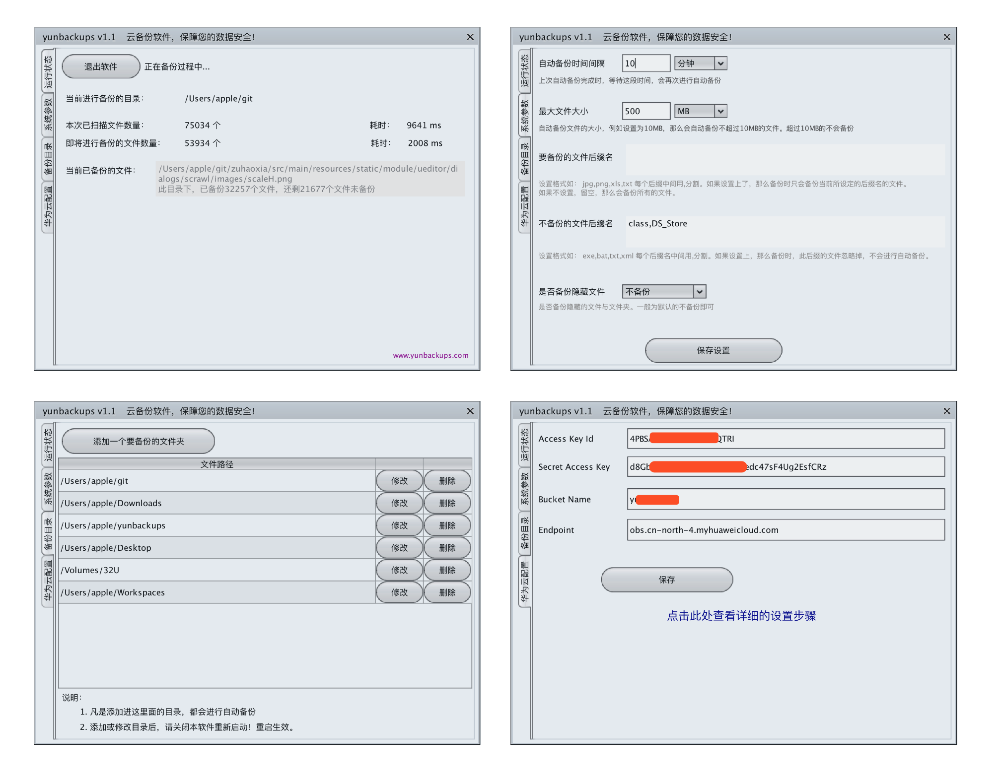

yunbackups 云备份软件，纯Java编写，提供命令行方式、以及可视化界面两种方式运行。用户可以将自己电脑、或手机、或服务器等文件，进行备份。
目前可以将备份的文件存放到华为云对象存储（归档存储）、以及FTP进行存储。

## 软件界面

## 软件功能
1. 自定义要备份的目录，不限目录数量
1. 可设定自动备份时间间隔
1. 可设置自动备份最大文件的大小上限，超过则不会备份
1. 可设置要备份的文件后缀名，若设置，则只备份这个后缀名的文件
1. 可设置不备份的文件后缀名，若设置，则忽略这个后缀名的文件不备份
1. 可设置是否备份隐藏的文件
1. 可实时查看当前运行的状态，备份进度情况
1. 可自定义将文件备份到华为云OBS、还是自建ftp服务器

## 软件下载使用

## 开发
JDK8、Maven3
1. 本项目为Maven项目，导入你的编辑器
2. 运行 com.xnx3.yunbackups.visualApp.ClientEntry 
