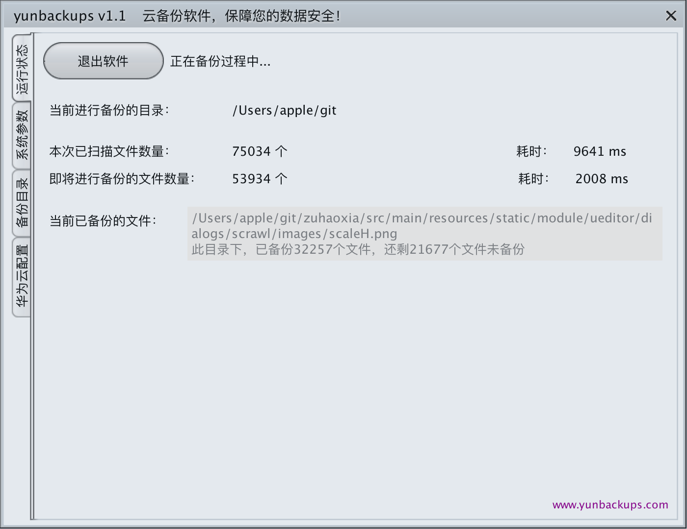
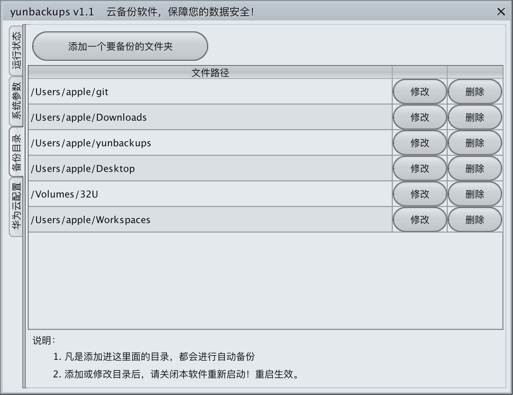
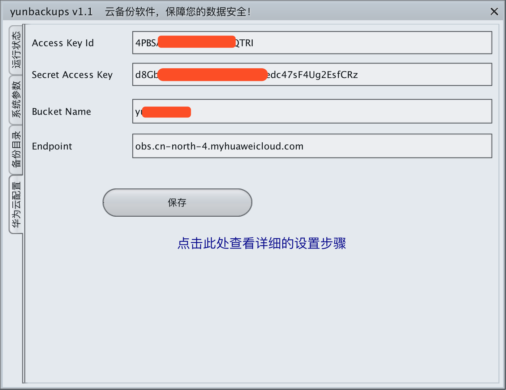

yunbackups 云备份软件，纯Java编写，提供命令行方式、以及可视化界面两种方式运行。用户可以将自己电脑、或手机、或服务器等文件，进行备份。
目前可以将备份的文件存放到华为云对象存储（归档存储）、以及FTP进行存储。

## 软件成品下载使用体验

## 软件界面
<figure class="third">
    
</figure>

#### 1. 运行状态

软件当前备份的实时状态，是否正在备份、正在备份的目录、当前目录扫描文件的数量及耗时、筛选出要进行备份的文件、数量及耗时、以及筛选完毕后当前备份的进度等。
软件开启后会自动进行备份，便是会看到当前进度状态。 

#### 2.系统参数

对软件进行系统性的设置。具体设置项如下：
1. **自动备份时间间隔**：可以设置自动备份完毕后，等待多长时间开始下一次备份，这样软件后台运行过程中，会自动循环备份最新文件。
1. **最大文件大小**：可以设置可备份文件的最大大小，超过这个大小就不会进行备份。例如设置为10MB，那么会自动备份不超过10MB的文件。超过10MB的不会备份。
1. **要备份的文件后缀名**：设置格式如： jpg,png,xls,txt  每个后缀中间用,分割。如果设置上了，那么备份时只会备份当前所设定的后缀名的文件。如果不设置，留空，那么会备份所有的文件。
1. **不备份文件的后缀名**：设置格式如： exe,bat,txt,xml  每个后缀名中间用,分割。如果设置上，那么备份时，此后缀的文件忽略掉，不会进行自动备份。
1. **是否备份隐藏文件**：如果设置上备份，那么文件属性为隐藏的文件、文件夹也会一起进行备份。

#### 3.备份目录

可以设定多个目录进行备份。凡事设定好的目录，都会自动进行备份，保障目录内的文件安全。

